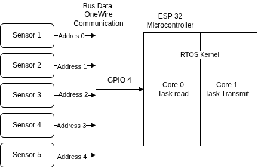

# IoT-Core-RTOS
Implementation of advanced embedded systems concepts on ESP32: Dual-core multitasking with FreeRTOS, Thread-safe shared memory management, and Low-level bit-banging for custom DHT libraries.

# ESP32 Advanced Firmware: Multitasking, Shared Memory, and Custom Drivers

Repositori ini berisi serangkaian proyek pengembangan firmware tingkat lanjut menggunakan **ESP32**, **C++ Object-Oriented Programming (OOP)**, dan **FreeRTOS**. Proyek ini mendemonstrasikan kemampuan arsitektur sistem tertanam yang efisien, aman (*thread-safe*), dan performa tinggi.

## 📂 Struktur Repositori
Setiap modul folder berisi file `.ino` dan gambar skema rangkaian:

1. [cite_start]**`1.LED_Controller`**: Kontrol LED berbasis objek dengan enkapsulasi logika hardware[cite: 1, 2].
2. [cite_start]**`2.Multisensor_RTOS`**: Sistem monitoring sensor DS18B20 menggunakan Dual-Core dan Message Queue[cite: 58, 60].
3. [cite_start]**`02_DHT_Custom_Library`**: Implementasi driver sensor DHT kustom berbasis bit-banging[cite: 27].
4. [cite_start]**`04_RTOS_Shared_Buffer_Mutex`**: Manajemen shared memory menggunakan Mutex Semaphore[cite: 88, 90].

---

## 🛠️ Penjelasan Detail Modul

### 1. LED Controller (Object-Oriented Programming)
[cite_start]Mengimplementasikan manajemen LED menggunakan paradigma OOP untuk meningkatkan kemudahan pemeliharaan kode (*maintainability*)[baris: 1, 2].
* [cite_start]**Enkapsulasi**: Menyembunyikan kompleksitas logika *Active LOW* dan *Active HIGH* di dalam class `LedController`[baris: 1, 4, 6].
* [cite_start]**State Management**: Mendukung mode statis dan mode kedip (*blink*) tanpa menggunakan fungsi `delay()` yang menghambat proses utama[baris: 10, 15].
* [cite_start]**Scenario Control**: Menggunakan skenario demo otomatis yang berpindah setiap 2 detik menggunakan *state machine*[baris: 16, 18].

### 2. Multisensor Monitoring (FreeRTOS Dual-Core)
[cite_start]Optimasi pembacaan 5 sensor DS18B20 menggunakan fitur *Multitasking* asli ESP32[baris: 58, 66].
* **Dual-Core Task Pinning**: 
    * [cite_start]**TaskReadSensors**: Berjalan di Core 0 untuk akuisisi data sensor DS18B20 secara deterministik[baris: 65, 83].
    * [cite_start]**TaskTransmit**: Berjalan di Core 1 untuk menangani output data tanpa mengganggu proses pembacaan[baris: 75, 84].
* [cite_start]**Message Queue**: Menggunakan `xQueueCreate` untuk memindahkan data antar task secara asinkron, memastikan tidak ada data yang hilang saat transmisi[baris: 81, 82].
* [cite_start]**High Efficiency**: Mengatur resolusi sensor ke 9-bit dan menggunakan mode *non-blocking* untuk mempercepat waktu konversi suhu[baris: 62].

### 3. Custom DHT Driver (Low-Level Bit Banging)
[cite_start]Pengembangan library mandiri untuk membaca sensor DHT11/DHT22 dengan mematuhi protokol komunikasi data 40-bit sesuai datasheet[baris: 27, 45].
* [cite_start]**Signal Timing**: Mengirim sinyal *start* (18ms/1ms) dan mendeteksi pulsa respon sensor (80µs)[cite: 41, 44].
* [cite_start]**Bit Parsing**: Membedakan bit 0 dan 1 berdasarkan durasi pulsa HIGH (26-28µs vs 70µs)[baris: 46, 47].
* [cite_start]**Thread Safety**: Menggunakan `noInterrupts()` saat proses pembacaan bit kritis untuk menjaga akurasi timing mikrodetik dari gangguan task sistem lain[baris: 43, 48].
* [cite_start]**Data Integrity**: Memvalidasi data melalui perhitungan *checksum* 8-bit[baris: 49].

---

### 4. Shared Buffer Management (Mutex Semaphore)
[cite_start]Solusi untuk mengelola akses ke sumber daya bersama (*shared resource*) guna mencegah *Race Condition*[cite: 88, 90].
* [cite_start]**Critical Section**: Menggunakan **Mutex Semaphore** (`xSemaphoreCreateMutex`) untuk mengunci akses ke buffer saat data sedang diperbarui[baris: 93, 94].
* **Producer-Consumer Pattern**:
    * [cite_start]**Sensor Task**: Menghasilkan data simulasi dan memperbarui buffer secara aman[baris: 93, 95].
    * [cite_start]**Comm Task**: Membaca data dari buffer dan mengirimkannya secara periodic tanpa terjadi tabrakan data[baris: 97, 98].
* [cite_start]**Thread Safety**: Menjamin integritas data meskipun diakses oleh dua task dengan prioritas berbeda secara bersamaan[baris: 101, 103].

---

## 🚀 Cara Menjalankan
1. Clone repositori ini.
2. Buka folder proyek menggunakan Arduino IDE.
3. Pastikan Board **ESP32 Dev Module** sudah terpasang.
4. [cite_start]Install library **OneWire** dan **DallasTemperature** melalui Library Manager[baris: 58].
5. Upload kode dan buka Serial Monitor pada baud rate 9600 atau 115200.

---
**Author**: Alan Firdaus
*S1 Sistem Komputer - Konsentrasi Robotika Industri*